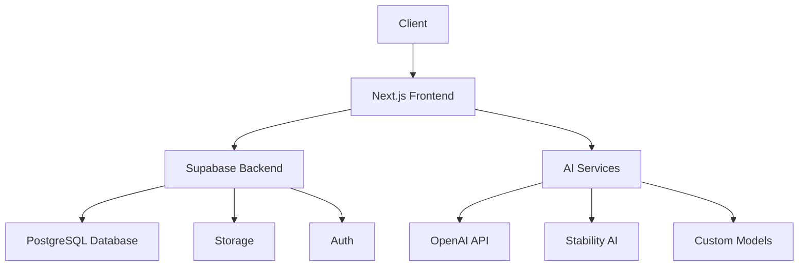
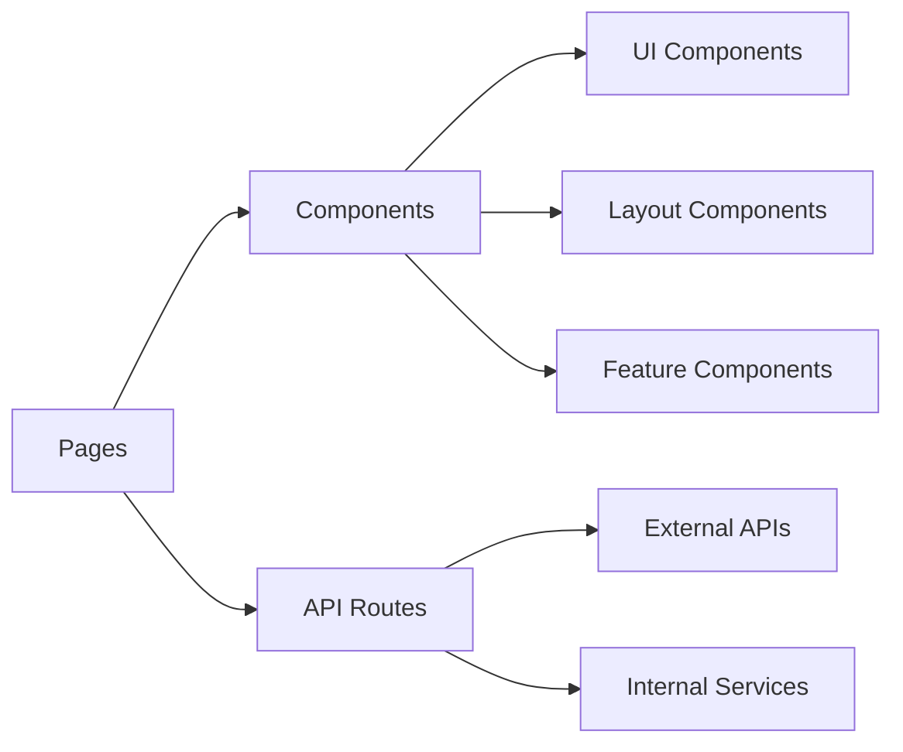
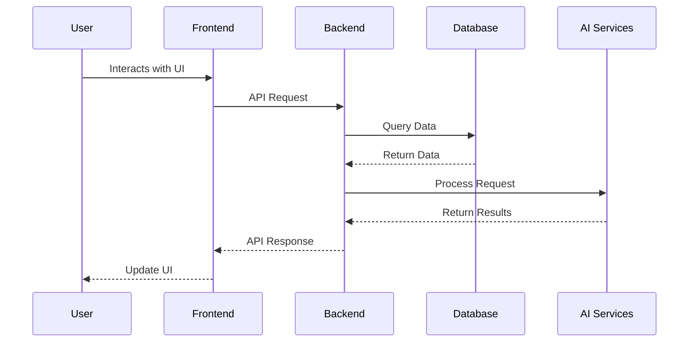
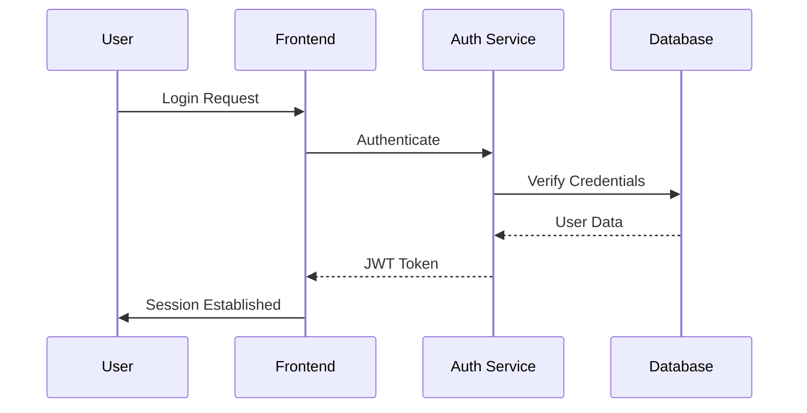
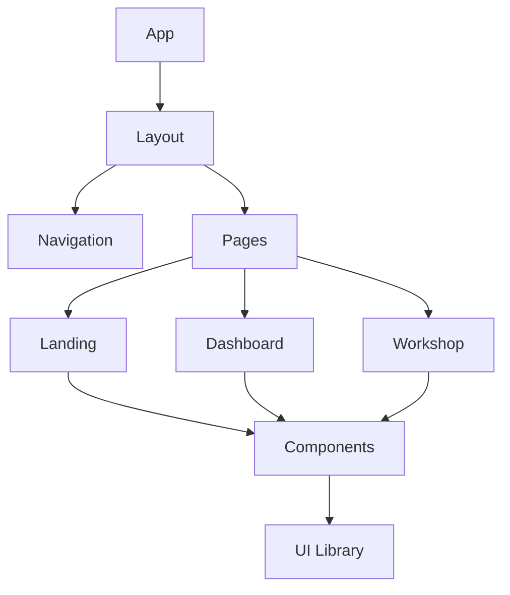
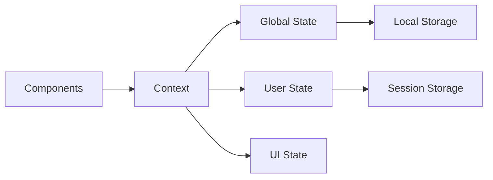
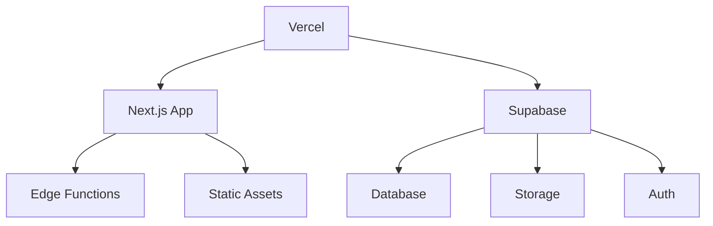
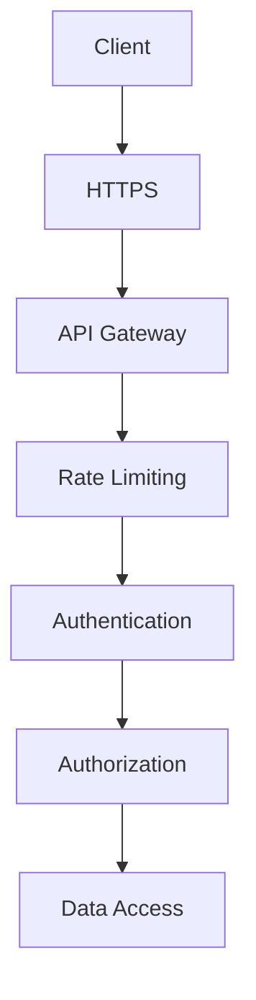
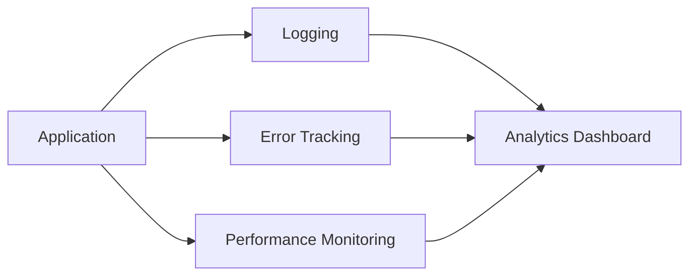

# AI24 Architecture

## System Overview

AI24 is built as a modern web application using Next.js v15 with the App Router, leveraging Supabase for backend services. The architecture follows a modular design pattern, separating concerns by user roles and features.



## 🏗️ Architecture Diagram

```
┌─────────────────────────────────────────────────────────────────┐
│                        Client Layer                              │
│  ┌─────────────┐  ┌─────────────┐  ┌─────────────┐             │
│  │  Next.js    │  │  Tailwind   │  │  Framer     │             │
│  │  App Router │  │    CSS      │  │  Motion     │             │
│  └─────────────┘  └─────────────┘  └─────────────┘             │
└─────────────────────────────────────────────────────────────────┘
                               │
                               ▼
┌─────────────────────────────────────────────────────────────────┐
│                        API Layer                                 │
│  ┌─────────────┐  ┌─────────────┐  ┌─────────────┐             │
│  │  Server     │  │  Edge       │  │  Middleware │             │
│  │  Actions    │  │  Functions  │  │  Layer      │             │
│  └─────────────┘  └─────────────┘  └─────────────┘             │
└─────────────────────────────────────────────────────────────────┘
                               │
                               ▼
┌─────────────────────────────────────────────────────────────────┐
│                        Backend Services                          │
│  ┌─────────────┐  ┌─────────────┐  ┌─────────────┐             │
│  │  Supabase   │  │  Mux        │  │  Stripe     │             │
│  │  (Auth, DB, │  │  (Video)    │  │  (Payments) │             │
│  │   Storage)  │  │             │  │             │             │
│  └─────────────┘  └─────────────┘  └─────────────┘             │
└─────────────────────────────────────────────────────────────────┘
```

## Frontend Architecture



## 📁 Directory Structure

```
/app
├── (auth)/
│   ├── login/
│   └── register/
├── (dashboard)/
│   ├── artist/
│   ├── educator/
│   └── partner/
├── workshops/
├── showcase/
├── livestreams/
├── profile/
└── api/
```

## 🔧 Core Components

### Frontend
- **Next.js v15**: App Router, Server Components, Server Actions
- **Tailwind CSS**: Styling and theming
- **Framer Motion**: Animations and interactions
- **SWR/React Query**: Data fetching and caching

### Backend
- **Supabase**: Authentication, Database, Storage
- **Mux**: Video streaming and processing
- **Stripe**: Payment processing
- **Sanity CMS**: Content management

## Data Flow



## 🔐 Authentication Flow



1. User initiates login/register
2. Supabase Auth handles authentication
3. JWT token stored in secure cookie
4. RLS policies enforce data access
5. User profile created/updated

## 💾 Data Model

### Users
```sql
create table users (
  id uuid references auth.users primary key,
  email text unique,
  role text check (role in ('artist', 'educator', 'partner')),
  created_at timestamp with time zone default timezone('utc'::text, now()),
  updated_at timestamp with time zone default timezone('utc'::text, now())
);
```

### Workshops
```sql
create table workshops (
  id uuid default uuid_generate_v4() primary key,
  title text not null,
  description text,
  educator_id uuid references users(id),
  start_time timestamp with time zone,
  end_time timestamp with time zone,
  capacity integer,
  status text check (status in ('draft', 'scheduled', 'completed')),
  created_at timestamp with time zone default timezone('utc'::text, now())
);
```

### Media
```sql
create table media (
  id uuid default uuid_generate_v4() primary key,
  user_id uuid references users(id),
  type text check (type in ('image', 'video', 'audio')),
  url text not null,
  metadata jsonb,
  created_at timestamp with time zone default timezone('utc'::text, now())
);
```

## Component Hierarchy



## 🔄 State Management



- **Server State**: Managed by Supabase
- **Client State**: Managed by React Query
- **UI State**: Managed by React hooks
- **Form State**: Managed by React Hook Form

## 🚀 Deployment Architecture



- **Platform**: Vercel
- **Environments**: Development, Staging, Production
- **CI/CD**: GitHub Actions
- **Monitoring**: Sentry, Datadog

## 🔍 Security Layers



- **Authentication**: Supabase Auth with JWT
- **Authorization**: Row Level Security (RLS)
- **Data Protection**: Encryption at rest
- **API Security**: Rate limiting, CORS policies

## 📈 Monitoring & Analytics



- **Caching**: SWR/React Query
- **Optimization**: Next.js Image, Font optimization
- **Monitoring**: Performance metrics
- **Testing**: Jest, Cypress 