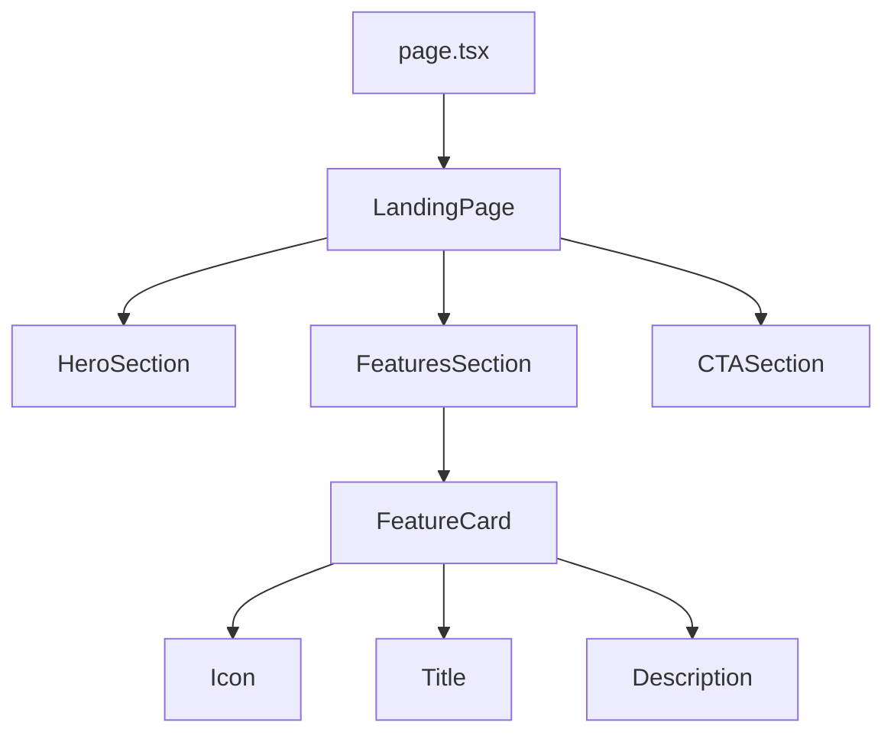

# AI24 Landing Page Documentation

## Current Implementation

### Structure
- Server Component (`page.tsx`)
  - Imports and exports the main landing page
  - Handles server-side rendering
- Landing Page Component (`landing-v2.tsx`)
  - Main container with gradient background
  - Three main sections:
    1. Hero Section
    2. Features/Offerings Section
    3. CTA Section

### Components
- **HeroSection**
  - Title with gradient text
  - Subtitle with brand essence
  - Description
  - CTA buttons
- **FeaturesSection**
  - Grid of feature cards
  - Each card with icon, title, and description
  - Hover effects and transitions
- **CTASection**
  - Compelling headline
  - Description
  - Primary CTA button

### Styling
- Uses Tailwind CSS
- Custom gradients and colors from brand guidelines
- Responsive design
- Hover effects and transitions
- Consistent spacing and typography

## Future Improvements

### Design
- [ ] Add glitch and scanline animations
- [ ] Implement kinetic typography
- [ ] Add interactive QR codes
- [ ] Create more dynamic hover effects
- [ ] Add parallax scrolling effects

### Content
- [ ] Add testimonials section
- [ ] Include workshop schedule
- [ ] Add artist showcase
- [ ] Implement live feed of AI-generated content
- [ ] Add interactive prompt challenges

### Functionality
- [ ] Add newsletter signup
- [ ] Implement workshop registration
- [ ] Add social media integration
- [ ] Create interactive AI demos
- [ ] Add language switcher

### Performance
- [ ] Optimize image loading
- [ ] Implement lazy loading
- [ ] Add loading states
- [ ] Optimize animations
- [ ] Add error boundaries

### Accessibility
- [ ] Improve keyboard navigation
- [ ] Add ARIA labels
- [ ] Implement focus management
- [ ] Add skip links
- [ ] Improve color contrast

## Component Structure

## State Management
- No client-side state needed
- All data is static
- Future implementations may require:
  - Newsletter subscription state
  - Workshop registration state
  - Interactive demo states

## Responsive Design
- Mobile-first approach
- Breakpoints:
  - sm: 640px
  - md: 768px
  - lg: 1024px
  - xl: 1280px
  - 2xl: 1536px

## Testing
- [ ] Add unit tests for components
- [ ] Implement visual regression testing
- [ ] Add accessibility testing
- [ ] Performance testing
- [ ] Cross-browser testing 